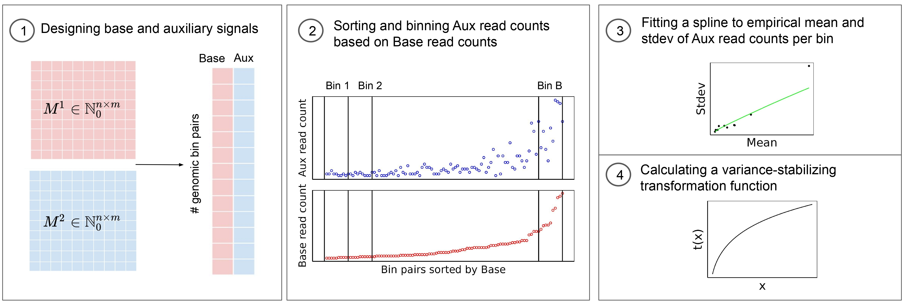

# Installation 

You can install the development version of vssHiC from [Github](https://github.com/nedashokraneh/vssHiC).

```{r installation, warning=F, message=F}
is_installed = "vssHiC" %in% rownames(installed.packages())
if (! is_installed){
  library(devtools)
  devtools::install_github("nedashokraneh/vssHiC")
}
```

```{r setup, warning=F, message=F}
library(vssHiC)
library(coolR)
library(ggplot2)
library(ggpubr)
library(HiContacts)
```

# Background

Genome-wide chromosome conformation capture assay Hi-C provides insights into chromatin 3D structures and their functional implications. Read counts from the Hi-C assay do not have constant variance, meaning we expect an observed interaction between a pair of genomic bins with an observed interaction of 1000 reads to have different (usually higher) uncertainty than another pair of genomic bins with 100 reads. This property of heteroskedasticity impedes visualization and downstream analyses. `vssHiC` is a statistical method to transform read counts so transformed signals have a unit variance across a dynamic range given a Hi-C experiment with two biological replicates available. We show that the heatmap visualization of pairwise contacts within a genomic region is more visually appealing given `vssHiC` signals compared to the raw and log-transformed signals. Furthermore, `vssHiC` signals improve the performance of subcompartment caller relying on Gaussian observed variables. `vssHiC` works with a well-developed R class (`InteractionSet`) and file format (`.cool`) for Hi-C data. 

```{r vssHiC, fig.retina = NULL, fig.align='center', fig.wide = TRUE, echo=FALSE}

```

# Load data

`vssHiC` takes two processed Hi-C data in `.cool` format as input and `vssHiC::cool2IntSet` loads interactions corresponding to one pair of chromosomes into `InteractionSet` object. `vssHiC::cool2IntSet` is adapted from `coolR::cool2IntSet` with two small modifications to load `InteractionSet` object corresponding to only one pair of chromosomes and handle inter-chromosomal interactions. 

```{r load}
files = list("../sample_data/GM12878_rep1.cool",
             "../sample_data/GM12878_rep2.cool")
chr = "21"
res = NULL

iset = vssHiC::cool2IntSet(files, chr, chr, res)
iset
```

## Variance instability of raw Hi-C signals

Estimated mean and standard deviations (stdev) across a dynamic range based on VSS algorithm show the dependency between mean and variance such that higher signal intensities have higher variance. This dependency is robust to auxiliary type choice (whether replicate 1 or replicate 2 is used as an auxiliary signal) as long as total read counts of two replicates are not very different. 

```{r variance instability, fig.width = 5, fig.height = 4, fig.align = 'left'}

# total number of read read counts per replicate

print(colSums(assay(iset)))

train.result1 = vssHiC::vssHiC.train(iset, "rep1")
train.result2 = vssHiC::vssHiC.train(iset, "rep2")

ggplot() +
  geom_line(data = train.result1$vss_mean_sd[train.result1$vss_mean_sd$mean < 500, ],
            aes(x = mean, y = pred_sd, colour = "rep1")) +
  geom_line(data = train.result2$vss_mean_sd[train.result2$vss_mean_sd$mean < 500, ],
            aes(x = mean, y = pred_sd, colour = "rep2")) +
  xlab("Mean") + ylab("Fitted stdev") +
  theme(axis.title.x = element_text(size = 12),
        axis.title.y = element_text(size = 12)) +
  scale_color_manual(name = "Aux type", 
                     values = c("rep1" = "darkblue", 
                                "rep2" = "red"))
```

# Variance stabilization of Hi-C signals 

```{r variance stabilization, fig.width = 5, fig.height = 4, fig.align = 'left'}
vss.iset = vssHiC::vssHiC.transform(iset, train.result1$vss_fit)
vss.iset
```

## vssHiC signals have a unit variance

After variance stabilization, vssHiC signals have an approximate unit variance (stdev = 1) across a dynamic range. 

```{r unit variance, fig.width = 5, fig.height = 4, fig.align = 'left'}
vss.result = vssHiC::vssHiC.train(vss.iset, "rep1")
ggplot(data = vss.result$vss_mean_sd) +
  geom_point(aes(x = mean, y = sd)) +
  geom_line(aes(x = mean, y = pred_sd), colour = "green") +
  xlab("Mean") + ylab("Stdev") +
  theme(axis.title.x = element_text(size = 12),
        axis.title.y = element_text(size = 12)) 
```


# Downstream analysis 


## Visualization

One application of signals with a unit variance is their visualization. For example, the heatmap visualization of chromatin contact maps should reflect differences across a dynamic range of signals including small intensity of long-range interactions and large intensity of short-range interactions. A common heuristic variance stabilizing transformation, log function, inflates the variance of low-intensity signals while stabilizing the variance of larger signals. Therefore, the visualization of log-scaled contact maps results in a blurry expected plaid pattern of long-range interactions. 
The `plotMatrix` function from the `HiContacts` package designs a manual color map (`coolerColors`) carefully picked for Hi-C contact heatmaps for visualization of log-scaled signals. We show that signals with a unit variance alleviate the need for manual color maps and avoid blurry plaid patterns even with default color maps like `bgrColors`.

```{r echo=F}
subset_GI <- function(GI, res, start, end){
  seqname = unfactor(seqnames(anchors(GI)$first)@values)
  query = GRanges(seqnames = seqname,
                  IRanges(seq(start + 1, end, res),
                          seq(start + res, end, res)))
  subset_idx = (anchors(GI)$first %within% query) &
    (anchors(GI)$second %within% query)
  subset_GI = GI[subset_idx, ]
  return(subset_GI)
}

iset2GI <- function(iset, rep_num){
  GI = interactions(iset)
  GI$count = assay(iset)[, rep_num]
  return(GI)
}
```


```{r vssHiC_visualization, fig.show="hold", out.width="100%"}
vss_GI = iset2GI(vss.iset, 1)
vss_GI_sub = subset_GI(vss_GI, 100000, 30000000, 42000000)
vss_mat_plot1 = plotMatrix(vss_GI_sub, scale = "linear", cmap = bgrColors())
vss_mat_plot2 = plotMatrix(vss_GI_sub, scale = "linear", cmap = coolerColors())
ggarrange(vss_mat_plot1,
          vss_mat_plot2,
          ncol=2)
```

```{r log_visualization, fig.show="hold", out.width="100%"}
raw_GI = iset2GI(iset, 1)
raw_GI_sub = subset_GI(raw_GI, 100000, 30000000, 42000000)
log_mat_plot1 = plotMatrix(raw_GI_sub, scale = "log10", cmap = bgrColors())
log_mat_plot2 = plotMatrix(raw_GI_sub, scale = "log10", cmap = coolerColors())
ggarrange(log_mat_plot1,
          log_mat_plot2,
          ncol=2)
```

## Wrapper functions for TAD callers given InteractionSet object

`vssHiC` has wrapper functions for three TAD callers, [TopDom](https://github.com/HenrikBengtsson/TopDom), [SpectralTAD](https://github.com/dozmorovlab/SpectralTAD), and [HiCseg](https://rdrr.io/cran/HiCseg/) to take `InteractionSet` as input, call TADs, and return `GRanges` object including identified TAD ranges. `GRanges` objects can be easily visualized on top of the `plotMatrix`  output.


```{r echo=F}

plotMatrixBorder <- function(GI, borders, scale = "log10",
                             cmap = bgrColors(), title){
  map_plot = plotMatrix(GI, scale = scale, cmap = cmap)
  if (! is.null(title)){
     map_plot = map_plot + 
       ggtitle(title) +
       theme(plot.title = element_text(size = 12))
  }
  filtered_borders <- tibble::as_tibble(
    borders[borders %over% GI]
  )
  num_borders = dim(filtered_borders)[1]
  filtered_borders = filtered_borders[1:(num_borders - 1), ]
  borders_plot <- geom_point(data = filtered_borders,
                           mapping = aes(x = end, y = end),
                           inherit.aes = FALSE,
                           shape = 21,
                           fill = "#76eaff",
                           color = "#000000",
                           size = 2) 
  
  return(map_plot + borders_plot)
}
```
```{r TAD_visualization, fig.show="hold", out.width="100%"}
rep_num = 1
hicseg_res = iset_hicseg(iset, 
                         rep_num, 
                         max_cp = 40, 
                         model = "D", 
                         dist = "G")

window_size = 2000000
topdom_res = iset_topdom(iset,
                         rep_num,
                         100000,
                         window_size)

spectral_res = iset_spectralTAD(iset,
                                rep_num,
                                100000,
                                window_size)

spectral_plot = plotMatrixBorder(vss_GI_sub, spectral_res, 
                                 scale = "linear", title = "SpectralTAD")
topdom_plot = plotMatrixBorder(vss_GI_sub, topdom_res,
                               scale = "linear", title = "TopDom")
hicseg_plot = plotMatrixBorder(vss_GI_sub, hicseg_res,
                               scale = "linear", title = "HiCseg")
ggarrange(spectral_plot,
          topdom_plot,
          hicseg_plot,
          ncol=2)
```

# Citation 

Neda Shokraneh Kenari, Faezeh Bayat, Maxwell Libbrecht. [VSS-Hi-C: Variance-stabilized signals for chromatin contacts](https://doi.org/10.1101/2021.10.19.465027). bioRxiv 2021.10.19.


```{r}
sessionInfo()
```
